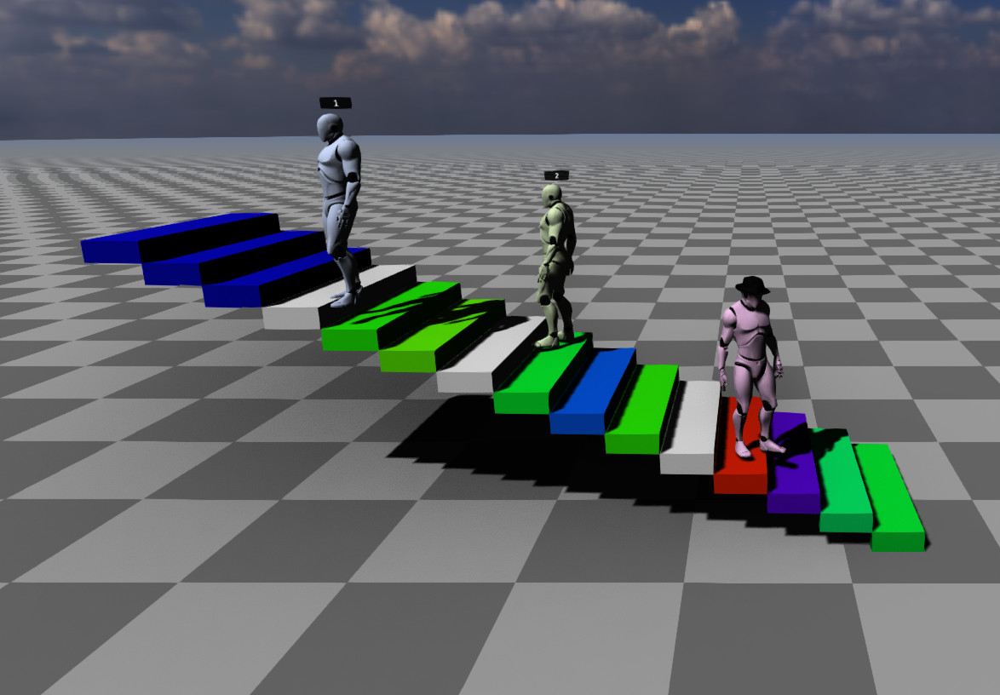

# (MML) 3D Web Experience

This repository contains packages used to run a web-based, multi-user 3D web experience that
supports [MML (Metaverse Markup Language)](https://mml.io/). 

It can be easily deployed to environments that support Node.js and can expose ports to the internet.



## Packages

This repository includes the following published packages:

- [`@mml-io/3d-web-experience-client`](./packages/3d-web-experience-client)
  - Client for a 3D web experience that includes user position networking, MML content composition, 
    MML-based avatars, and text chat.
- [`@mml-io/3d-web-experience-server`](./packages/3d-web-experience-server)
  - Server for a 3D web experience that includes user position networking, MML hosting, and text chat.
- [`@mml-io/3d-web-client-core`](./packages/3d-web-client-core)
  - The main components of a 3D web experience (controls, rendering, MML composition etc.) that can be 
    extended with other packages to create a full 3D web experience.
- [`@mml-io/3d-web-user-networking`](./packages/3d-web-user-networking)
  - WebSocket server and client implementations that synchronize user positions.
- [`@mml-io/3d-web-avatar`](./packages/3d-web-avatar)
  - Creates and parses MML documents for avatars (using `m-character`).
- [`@mml-io/3d-web-avatar-editor-ui`](./packages/3d-web-avatar-editor-ui)
  - UI components (e.g. parts pickers) for creating avatars.
- [`@mml-io/3d-web-standalone-avatar-editor`](./packages/3d-web-standalone-avatar-editor)
  - An MML avatar editor (using `m-character`).
- [`@mml-io/3d-web-text-chat`](./packages/3d-web-text-chat)
  - Contains WebSocket server and client implementations for text chat.
- [`@mml-io/3d-web-voice-chat`](./packages/3d-web-voice-chat)
  - Client implementation for spatial voice chat.

## Main features

- Multiple users can connect to the experience using just a web browser.
- Users can interact simultaneously with the stateful MML documents.
- Easy to deploy and extend with interactive MML content.

### Auth Flow
- When the client page is rendered by the server, the server uses a UserAuthenticator implementation to determine if a session should be generated for the incoming http request and if so includes that session token on the client page.
- The client then sends the session token in the first message to the server when it connects via websocket.
- The server can use the session token to authenticate the user and determine what identity (username, avatar etc) the user should have.
- An example implementation of this is provided in the example server, but the interface is extensible enough that a more complex user authenticator can limit which avatar components should be permitted based on external systems.


## Running Examples & Iterating Locally

Making sure you have Node.js installed, run the following from the root of the repository:

```bash
npm install
npm run iterate
```

## Examples
 
- [`example/multi-user-3d-web-experience`](./example/multi-user-3d-web-experience)
  - Once the server is running (see [above](#running-examples--iterating-locally)), open `http://localhost:8080`.
  - A client and server pair of packages that uses the `@mml-io/3d-web-experience-client` and `@mml-io/3d-web-experience-server` packages to create a multi-user 3d web experience that includes MML hosting and text chat.
- [`example/local-only-multi-user-3d-web-experience`](./example/local-only-multi-user-3d-web-experience)
  - Once the server is running (see [above](#running-examples--iterating-locally)), open `http://localhost:8081`.
  - A client that uses the various packages to create a 3d web experience that only works locally. No server is needed, but there is a server to serve the client.
- [`example/web-avatar-editor`](./example/web-avatar-editor)
  - Once the server is running (see [above](#running-examples--iterating-locally)), open `http://localhost:8082`.
  - An avatar editor that uses the `@mml-io/3d-web-standalone-avatar-editor` to create and edit MML avatars and a simple Express server that hosts the editor.
