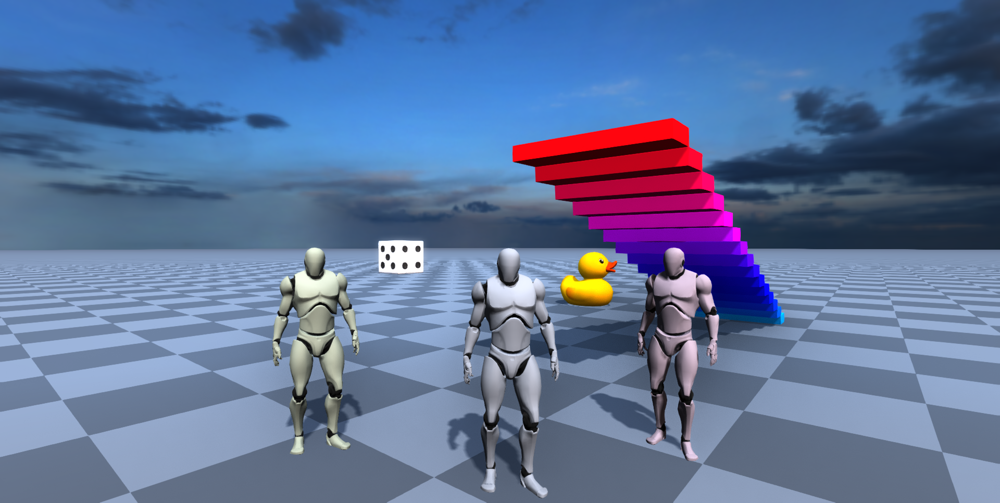

# (MML) 3D Web Experience

This repository contains packages used to run a web-based, multi-user 3D web experience that
supports [MML (Metaverse Markup Language)](https://mml.io/). This repository includes two published
packages:

- [`@mml-io/3d-web-client-core`](./packages/3d-web-client-core) - A package that implements the main
  components of a 3D web experience.
- [`@mml-io/3d-web-user-networking`](./packages/3d-web-user-networking) - A package that contains
  WebSocket server and client implementations that synchronize user positions.

There is an example implementation of a 3D web experience in the `examples` directory. This example
contains:

- `web-client`
  - A THREE.js 3D experience utilizing the `@mml-io/3d-web-client-core` and
    `@mml-io/3d-web-user-networking` packages to create a multi-user 3D web client that connects to
    the server.
- `server`
  - A server which serves the `web-client` and handles user networking WebSocket connections with
    `@mml-io/3d-web-user-networking`
  - Additionally, the server runs MML documents in the `mml-documents` directory which are then
    connected to by the `web-client`.

It can be easily deployed to environments that support Node.js and expose ports to the internet.



## Main features

- Multiple users can connect to the experience using just a web browser.

- Users can interact simultaneously with the stateful MML documents.

- Easy to deploy and extend with interactive MML content.

## Running locally

Making sure you have Node.js installed, run the following from the root of the repository:

```bash
npm install
npm run iterate
```

Once the example server is running, open `http://localhost:8080` in your browser.
